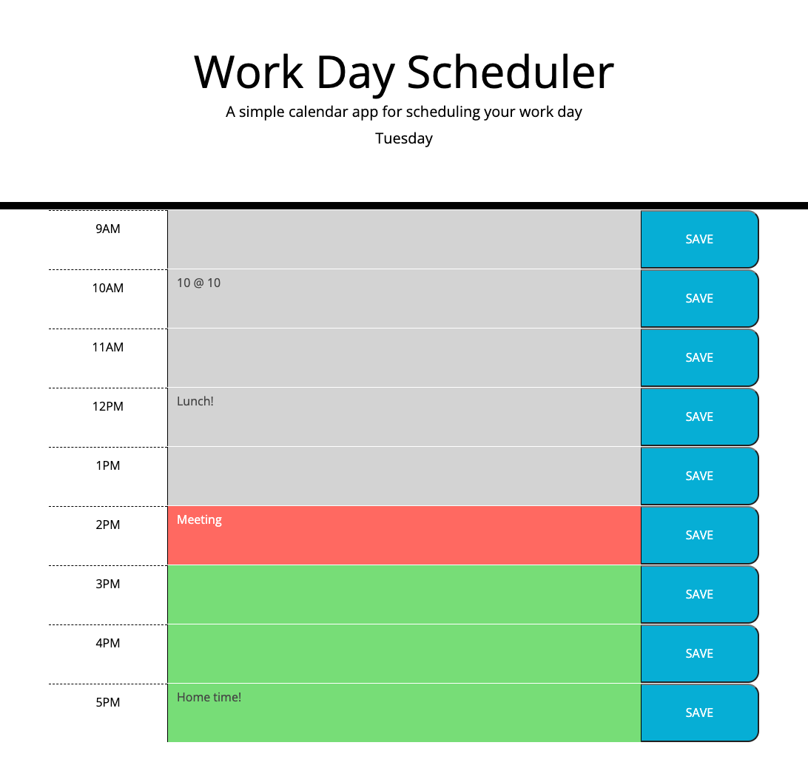

# scheduler-bc

Bootcamp Module 7 Challenge

## Website link

https://mattlusty.github.io/scheduler-bc

## Description

Bootcamp Module 6 Challenge

Dynamic time color coded scheduler diary.

Add your daily events and save them to persist them in local storage!

Displays current day

## Features

DayJS library powers the date and time keeping.

JQuery handles DOM manipulation.

Local storage remembers user added events.

Event time blocks have dynamically updated colors to indicate past, future and present.
